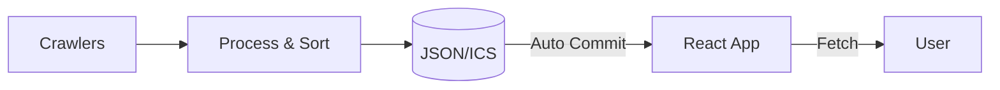

# MovieEventCalender

CGV, 메가박스, 롯데시네마 3사의 선착순 영화 할인 이벤트 정보를 통합해 제공하는 대시보드와 캘린더 서비스입니다.

## 주요 기능

- **통합 타임라인** — 3사 할인 정보를 시간순으로 정렬해 한눈에 확인
- **캘린더 연동** — Google Calendar 추가 및 ICS 구독으로 사전 알림 지원
- **모바일 최적화** — 따로 앱을 설치하지 않고 웹 브라우저에서 바로 사용하는 반응형 UI
- **자동화 시스템** — GitHub Actions를 활용한 정기 데이터 수집과 자동 배포

## 시스템 아키텍처



## 빠른 시작

### 1. 백엔드 (Python 3.10+)

```bash
cd backend
pip install -r requirements.txt && playwright install chromium
python main.py
```

### 2. 프론트엔드 (Node 20+)

```bash
cd frontend
npm install && npm run dev
```

## 수동 실행 및 관리

### 1. GitHub Actions (추천)

최신 데이터로 즉시 업데이트해야 할 때:
1. GitHub 리포지토리의 **Actions** 탭으로 이동합니다.
2. **Update Movie Coupon Events** 워크플로우를 선택합니다.
3. **Run workflow** 버튼을 클릭해 실행합니다.
   - 실행을 마친 후 `gh-pages` 브랜치로 최신 데이터를 자동 배포합니다.

### 2. 로컬 데이터 생성

```bash
# 로컬에서 데이터 수집 확인
python backend/main.py
```
- 생성한 `events.json`, `events.ics` 파일은 로컬 테스트용이며 Git에 커밋하지 않습니다.

## 프로젝트 구조

| 경로 | 설명 |
|------|------|
| `/backend` | Python 기반 크롤링 파이프라인 |
| `/frontend` | React 및 Tailwind CSS 기반 대시보드 |
| `/docs` | 상세 기획 및 기술 분석 문서 |

## 관련 문서

- [서비스 기획서](./영화%20할인%20통합%20대시보드%20기획서.md)
- [CGV 분석](./CGV%20스피드쿠폰%20크롤링%20분석.md) | [메가박스 분석](./메가박스%20빵원티켓%20크롤링%20분석.md) | [롯데시네마 분석](./롯데시네마%20무비싸다구%20크롤링%20분석.md)
